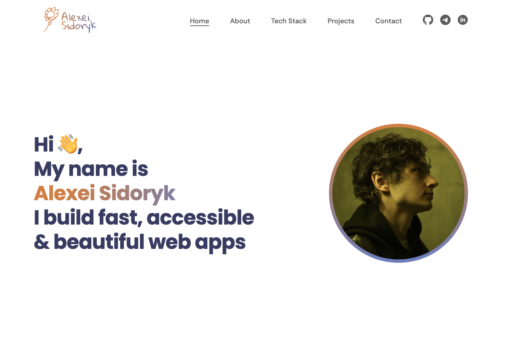

# 💼 Personal Portfolio — Alexei Sidoryk

A modern, fully responsive personal portfolio to showcase projects, skills, and contact information.  
Built with **React**, **SCSS**, and **Vite**, featuring smooth animations, SEO optimization, and an intuitive layout.

---

## 🚀 Features

- Responsive design for desktop, tablet, and mobile
- Smooth animations & transitions
- SEO-friendly structure
- Light & dark mode support
- Projects section with live demo and source code links
- Contact information & social links
- Modular SCSS structure

---

## 🛠 Tech Stack

- **Frontend:** React, Vite, JavaScript (ES6+), SCSS
- **Styling:** SCSS modules, CSS variables
- **Icons & Images:** SVG & custom graphics
- **Deployment:** Vercel / Netlify (choose your hosting)

---

## 📂 Project Structure

```
src/
├── assets/       # Fonts, icons, images
├── Components/   # Page sections and UI components
├── App.jsx       # Main app component
├── App.scss      # Global app styles
├── index.scss    # Base styles and variables
└── main.jsx      # Entry point
```

---

## 📸 Preview



---

## 📜 License & Credits

### 📌 Template Design
- **Original design by:** [PavanMG on Figma](https://www.figma.com/@pavanmg007)

### 📌 Icons
- Icons from **dddoodle** by Seb  
  Licensed under [Creative Commons Attribution 4.0](https://creativecommons.org/licenses/by/4.0/)  
  Source: [fffuel.co](https://fffuel.co)

### 📌 Code
- All source code in this repository is © Alexei Sidoryk.  
  **All rights reserved.**

---

## 📧 Contact

- **Email:** alexeisidorik@gmail.com  
- **GitHub:** [Alex223437](https://github.com/Alex223437)  
- **LinkedIn:** [Alexei Sidoryk](https://www.linkedin.com/in/alexei-sidoryk/)  
- **Telegram:** [@aliakseisi](https://t.me/aliakseisi)
